

# Hello, I'm Ahmad Majed

## Portfolio

### Interdimensional Gas Station
Unity · C#

&nbsp;&nbsp;&nbsp;&nbsp;Interdimensional Gas Station is a 2D puzzle game where the player is on a floating gas station in space, and must service complicated alien ships. The team consisted of only two people, so I had to wear many different hats while building this project, namely gameplay engineer, game designer, and art director. I programmed all of the gameplay mechanics and interfaces. The most obvious of these is the main mechanics that the player interacts with to play the game, as well as all other aspects of the game, from generating NPCs and ships to the flow of the game loop. 

&nbsp;&nbsp;&nbsp;&nbsp;I was also the game designer, building the initial prototype and designing the core gameplay loop and game identity. Instead of the standard dialogue choices to interact with the story, the player uses the ship tablet (the main gameplay interface) to interact with and affect the story in more interesting ways, such as stealing parts or giving coordinates for the NPC to travel to. 

&nbsp;&nbsp;&nbsp;&nbsp;Another one of my duties was collaborating with various artists to create art for the game. I had to shop around with multiple artists to find the right ones that fit the aesthetic and atmosphere of the game. Once I did, we went back and forth to iterate on their designs to perfect the final product. 

&nbsp;&nbsp;&nbsp;&nbsp;I also had to perform playtests to find bugs in the game and, more importantly, learn all of the design flaws that you can only see when someone is playing the game for the first time. I ran various playtests, at first watching people I knew play it live, then watching people at a convention playing it live, and finally releasing a playtest onto Steam and getting hundreds of players to give their feedback. Some even posted their playthroughs to YouTube, giving me additional insight. 

&nbsp;&nbsp;&nbsp;&nbsp;Currently, the game sits at over 4,500 wishlists on Steam, and the trailer at over 130,000 views on YouTube. 

<video src="Game_Footage/IGS_Trailer.mp4" controls width="100%"></video>

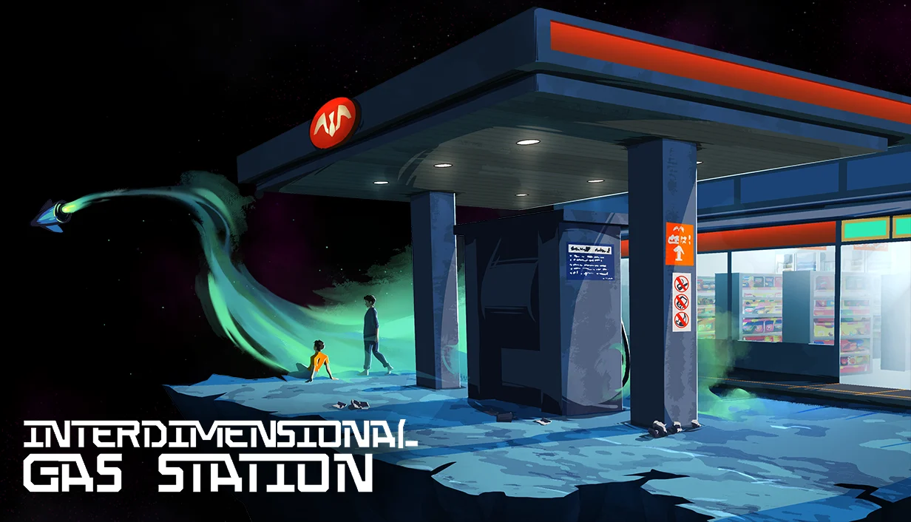
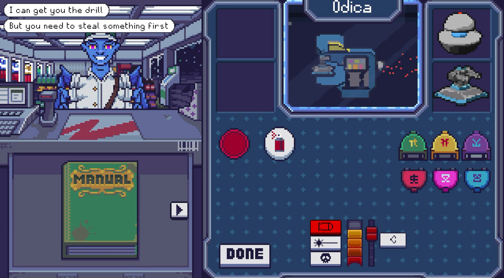
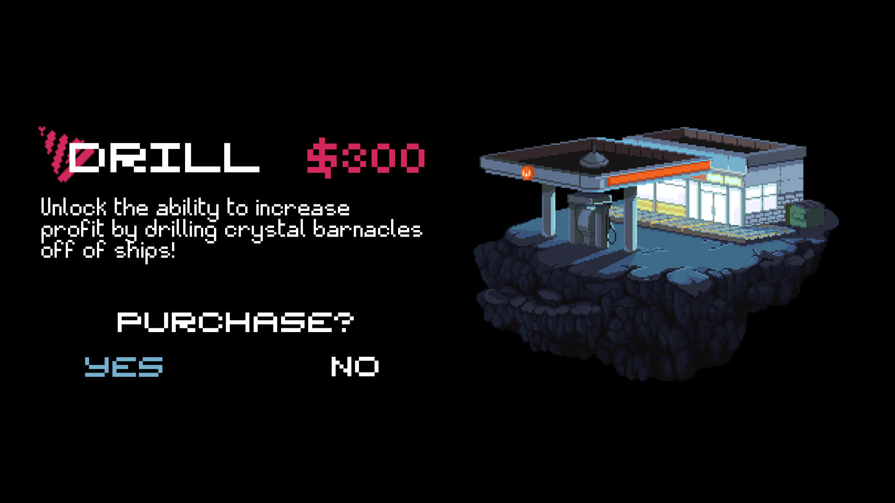
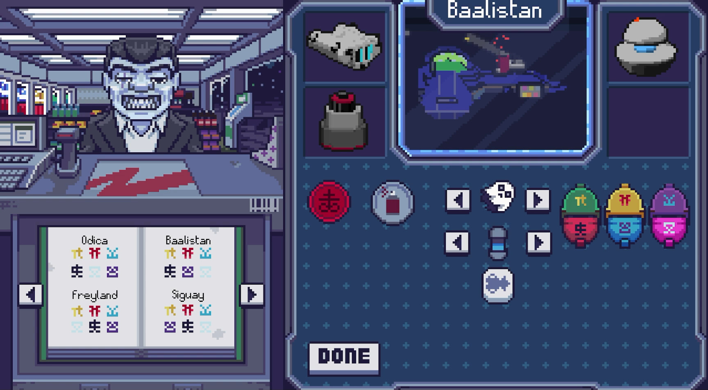
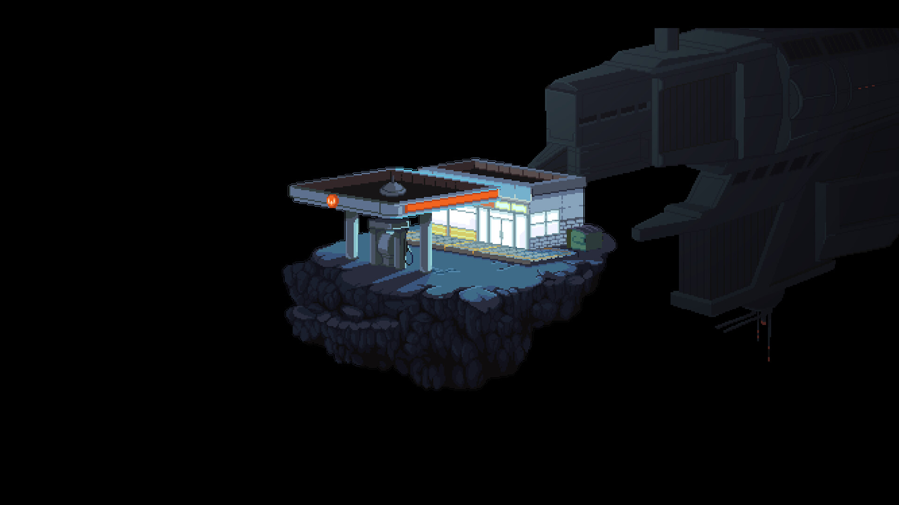

### Shotgun Gaiden
Unity · C#

&nbsp;&nbsp;&nbsp;&nbsp;Shotgun Gaiden is a student project made in Unity. It is a 3D first-person shooter-platformer. The main mechanic is that the player has a shotgun that launches them backwards, giving the player a tool to platform as well as a challenge when trying to kill enemies. On this project, my main roles were the physics and the particle effects. I created a custom physics system to simulate the force of the shotgun blast based on the direction the camera was facing. The system also supported friction, so the player would slide when they landed. I also created particle effects to create dust, fiery explosions and other smaller details to add visual flair and juice to the game. 

<video src="Game_Footage/ShotgunGaiden_Footage.mp4" controls width="100%"></video>
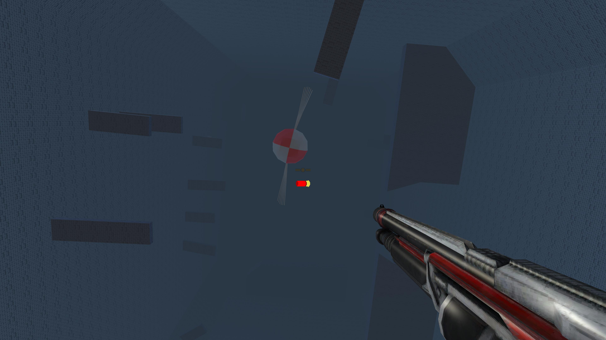
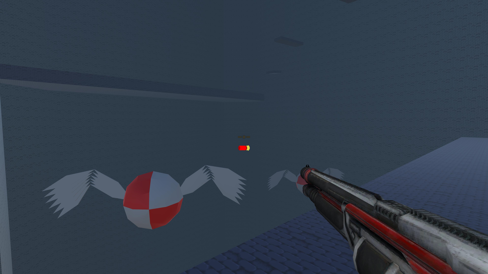
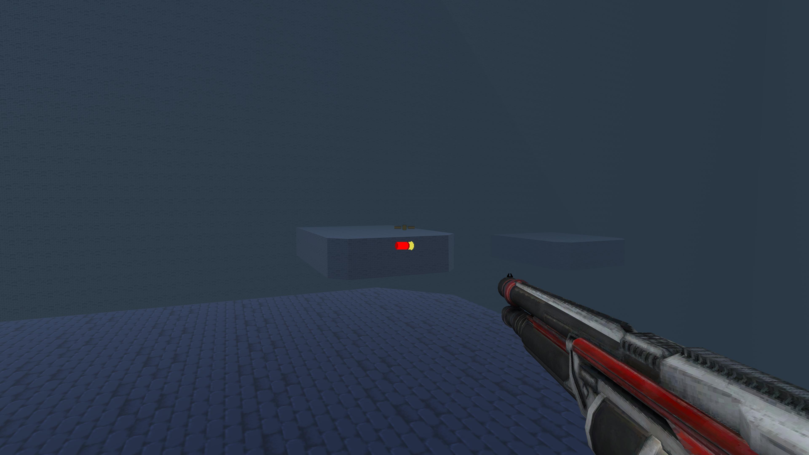
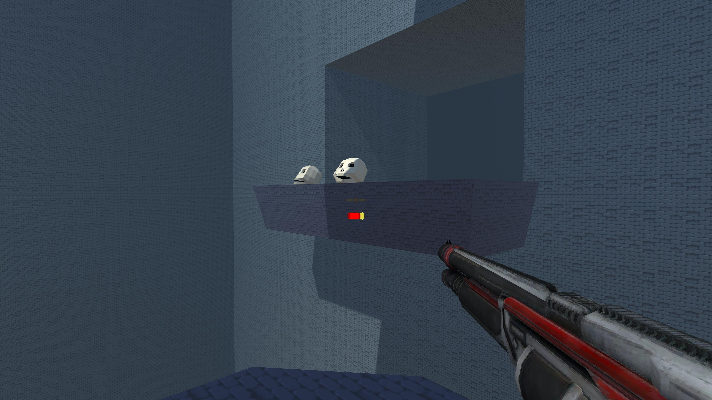

### The Glass Sword
Unity · C#

&nbsp;&nbsp;&nbsp;&nbsp;The Glass Sword is a 2D puzzle-platformer where the player cycles through multiple abilities to kill enemies and traverse the levels. The initial prototype was finished before I joined the team, and my role was refining and improving the core mechanics, as well as implementing new features. One of these features was animation. Since each ability required a different animation state, I had to build an animation graph where the player could flow smoothly from ability to ability, without missing a beat and looking choppy. I also had to add mobile support so that the game could be played on iOS devices. 

<video src="Game_Footage/TheGlassSword_Footage.mp4" controls width="100%"></video>
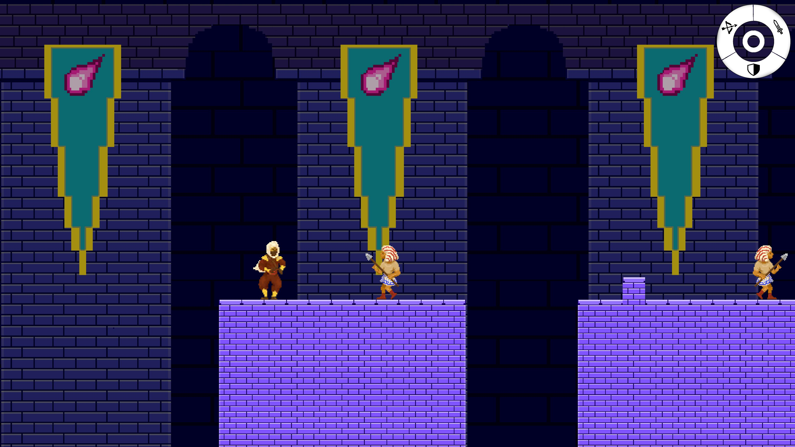
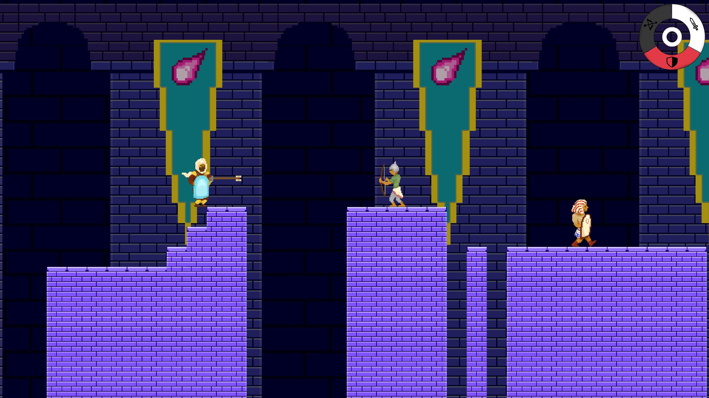
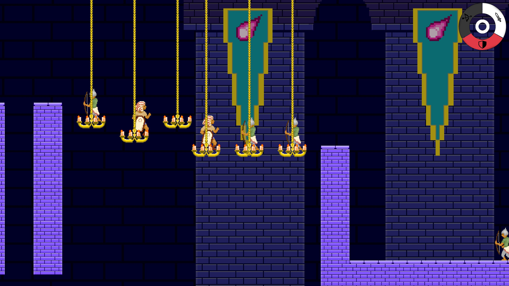
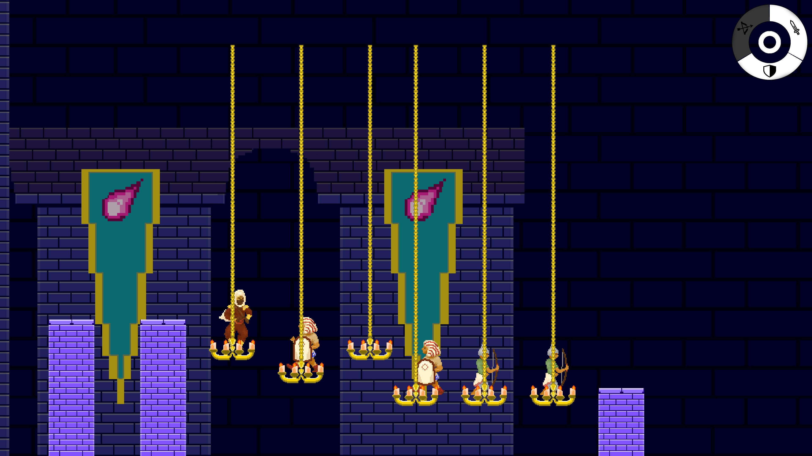

### Murders of Bavaria
Unreal Engine · C++

&nbsp;&nbsp;&nbsp;&nbsp;Murders of Bavaria is a 3D action-RPG built in Unreal Engine. This is another student project. I had just learned C++ for Unreal before this project, so it was a great exercise in implementing what I had learned. Because I was the only one with any Unreal experience on the team, I did a majority of the programming, which included: player controls, combat system, animations, and enemy AI. The enemies were the biggest challenge, giving them patrolling, chasing, and attacks; seamlessly integrating that with their animations. A lot of these features are built into Unreal and are much more involved than other engines and frameworks. I had to use its own animation graphs, AI graphs, pathfinding system, and even a character class specifically for third-person humanoid characters. 

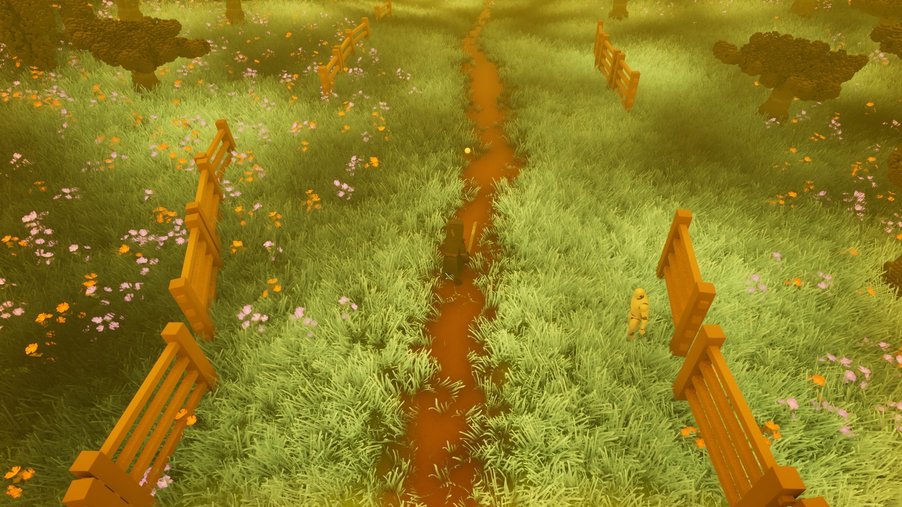
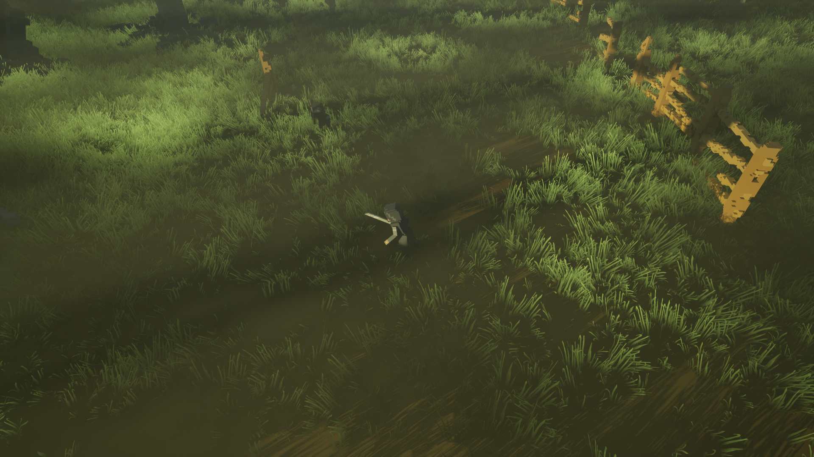
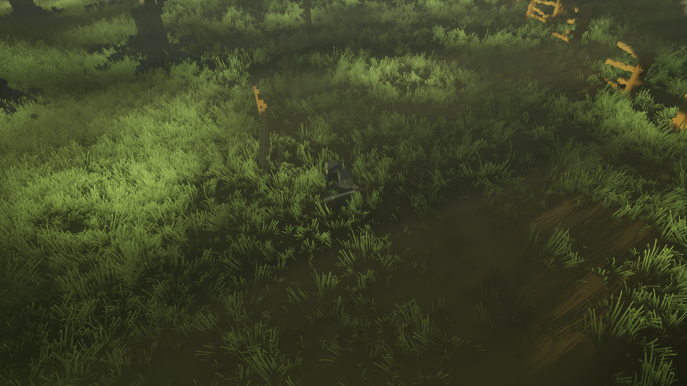
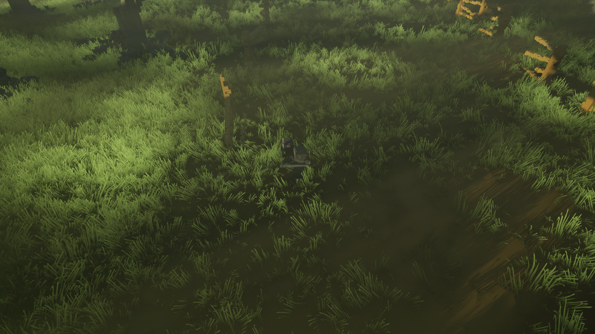

### Shadow Sudoku
Flutter · Dart

&nbsp;&nbsp;&nbsp;&nbsp;Shadow Sudoku was my first attempt at a mobile app. I built the UI using Flutter, and other user actions in Dart. This project was a far cry from the things I was familiar with, but it was a great experience in developing a complete product and launching it on the Apple App Store. 

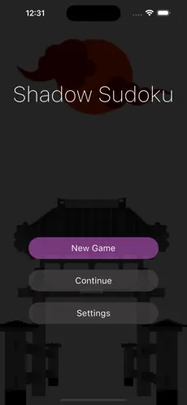
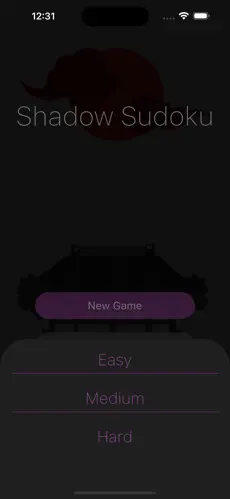
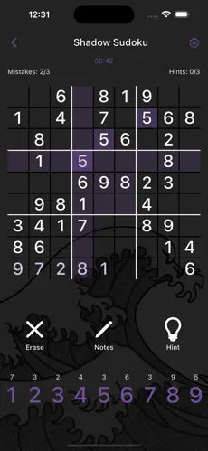
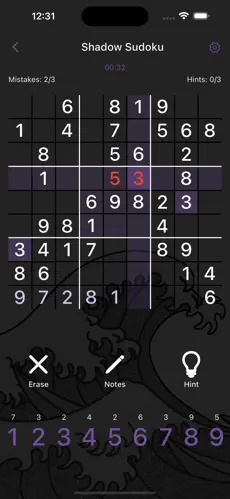

